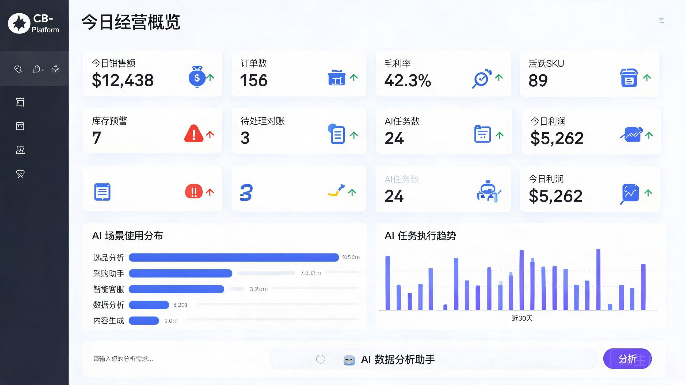

# CB-Platform 跨境电商智能运营中台



## 核心价值

**AI 驱动的跨境电商全链路运营平台**，覆盖「选品 → 采购 → 库存 → 财务 → AI 决策」完整业务闭环，面向家电美容赛道（个护电器 + 美容仪器 + 美体仪器 + 配件耗材）。

### 差异化能力

| 能力 | 传统 ERP | CB-Platform |
|---|---|---|
| 选品决策 | 人工经验判断 | AI 工作流多维度评分（毛利率/月销/评分/趋势/竞争度加权），输出推荐结论+风险提示 |
| 采购谈判 | 人工比价 | AI 谈判助手一键分析报价合理性、市场均价、交付风险、检查清单 |
| 客户服务 | 人工逐条回复 | AI 客服工作流自动生成多语言回复，意图识别+置信度+建议动作 |
| 数据分析 | BI 报表固定维度 | 自然语言转 SQL（Text2SQL），输入问题即返回 SQL+查询结果+业务洞察 |
| 工作流编排 | 无 | React Flow 可视化拖拽编排，7 种节点类型（input/llm/rag/text2sql/sql_execute/condition/output） |

## 技术架构

```
┌─────────────────────────────────────────────────────┐
│  Frontend (React 18 + TypeScript + Ant Design v5)  │
│  Vite + ECharts + React Flow + Zustand             │
├─────────────────────────────────────────────────────┤
│  Backend (Go 1.22 + Gin + GORM)                    │
│  ┌──────────┐ ┌──────────┐ ┌─────────────────────┐ │
│  │ REST API │ │ AI 引擎  │ │ Prometheus 指标     │ │
│  │ 8 模块   │ │ 7 节点   │ │ 4 项 AI 专用指标    │ │
│  └──────────┘ └──────────┘ └─────────────────────┘ │
├─────────────────────────────────────────────────────┤
│  MySQL │ Redis │ PostgreSQL(pgvector) │ Milvus     │
└─────────────────────────────────────────────────────┘
```

### 后端工程

- **领域驱动设计**：`interfaces/http` → `application` → `domain/models` → `pkg/database` 四层架构
- **AI 工作流引擎**：DAG 拓扑执行，支持 input → llm/rag/text2sql/sql_execute/condition → output 节点链路
- **LLM Provider 抽象**：GLM / Claude / DeepSeek / Qwen / OpenAI 兼容协议，API Key 为空时自动回退 BuiltinLLMProvider（基于场景识别的结构化输出）
- **Text2SQL**：自然语言 → SQL 生成 → SELECT 安全校验 → 执行 → 业务洞察生成
- **RAG 检索**：TF-IDF 关键词匹配（简化版），支持知识库文档上传+分块检索+上下文注入
- **定时调度器**：后台 goroutine 每分钟扫描启用的工作流，支持 scheduled 触发
- **Prometheus 指标**：`ai_workflow_runs_total` / `ai_workflow_duration_seconds` / `ai_workflow_tokens_total` / `ai_workflow_cost_usd`

### 前端工程

- **12 个业务页面**：工作台、选品列表、选品详情、采购管理、库存管理、财务管理、AI 工作流、工作流历史、客服消息、工作流编排、平台管理、登录
- **AI 决策卡**：ProductDetail 页点击「AI 深度分析」调用后端工作流，返回评分+推荐结论+理由+风险，本地算法兜底
- **AI 数据分析**：Dashboard 内嵌自然语言查询框，快捷问题 Tag，结果含 SQL+动态列表格+业务洞察
- **结构化结果展示**：5 种场景差异化渲染（评分仪表盘/报价对比/客服回复/SQL 结果表/Listing 生成）
- **工作流可视化编排**：React Flow 拖拽节点+连线+属性配置+JSON 导出
- **响应式设计**：移动端/桌面端断点适配，数据表格横向滚动

## 业务模块

| 模块 | 核心功能 |
|---|---|
| 选品管理 | AI 评分排行、选品漏斗、趋势图、竞品雷达、成本结构、AI 决策建议卡 |
| 采购管理 | 9 状态机流转（询价→报价→下单→跟踪→发货→收货→质检→对账→结算）、AI 谈判助手 |
| 库存管理 | 多仓覆盖（深圳主仓/美西/欧洲/FBA）、安全库存预警、库存变动流水 |
| 财务管理 | 账单对账、利润报表（每日 SKU 级收入/成本/净利润）、趋势分析 |
| AI 工作流 | 5 个预置场景、工作流历史记录、趋势图、Token/成本统计 |
| 客服消息 | 多平台消息聚合、AI 回复建议、意图识别、多语言支持 |
| 工作流编排 | 可视化拖拽编排、7 种节点类型、JSON 导出/导入 |

## 数据规模

- **51 个 Go 文件**，10,554 行后端代码
- **34 个 TypeScript/TSX 文件**，9,021 行前端代码
- **8 家供应商**（A/B/C 级，覆盖深圳/东莞/义乌/广州/佛山/宁波）
- **5 个仓库**（国内主仓 + 美西/欧洲海外仓 + FBA 仓）
- **5 个 AI 工作流**（选品分析/采购助手/智能客服/数据分析/内容生成）

## 技术栈

| 层 | 技术 |
|---|---|
| 后端 | Go 1.22、Gin、GORM、MySQL 8、Redis 7、PostgreSQL(pgvector)、Milvus |
| 前端 | React 18、TypeScript 5、Ant Design v5、Vite 5、ECharts 5、React Flow 11、Zustand |
| AI | GLM-4-Plus / Claude / DeepSeek / Qwen（Provider 抽象，无 Key 时 BuiltinLLMProvider） |
| 运维 | Docker Compose、Prometheus、Grafana、结构化日志 |

## 快速启动

```bash
# 1. 启动基础设施 + 后端
cd deployments
docker compose up -d

# 2. 启动前端
cd web
pnpm install
pnpm dev

# 3. 访问
# 前端: http://localhost:5174
# 后端: http://localhost:8088
# 默认账号: admin / admin123
```

## 项目结构

```
cb-platform/
├── cmd/server/              # 后端入口
├── internal/
│   ├── application/         # 业务逻辑层
│   │   ├── ai/             # AI 工作流引擎(7 节点类型 + 调度器 + RAG)
│   │   ├── finance/        # 财务服务
│   │   ├── inventory/      # 库存服务
│   │   └── purchase/       # 采购状态机
│   ├── domain/models/      # 领域模型(15+ 实体)
│   ├── interfaces/http/    # HTTP 接口层(12 个 handler)
│   └── pkg/                # 基础设施(config/database/middleware/logger/response)
├── web/                     # 前端(12 个页面)
│   └── src/
│       ├── pages/          # 业务页面
│       ├── api/            # API 封装
│       ├── components/     # 通用组件
│       ├── store/          # Zustand 状态管理
│       └── types/          # TypeScript 类型定义
├── deployments/             # Docker Compose 部署
└── docs/                    # 文档与截图
```
